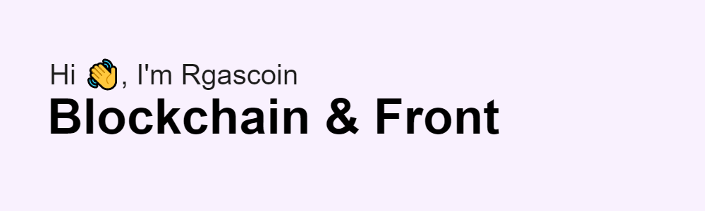

<!--
**Rgascoin/Rgascoin** is a ✨ _special_ ✨ repository because its `README.md` (this file) appears on your GitHub profile.
-->

# My Skills 🌟

# My current activity 😊

<!--START_SECTION:activity-->
1. 🗣 Commented on [#110](https://github.com/aleph-im/aleph-sdk-ts/issues/110) in [aleph-im/aleph-sdk-ts](https://github.com/aleph-im/aleph-sdk-ts)
2. ❗️ Opened issue [#113](https://github.com/aleph-im/aleph-sdk-ts/issues/113) in [aleph-im/aleph-sdk-ts](https://github.com/aleph-im/aleph-sdk-ts)
3. 💪 Opened PR [#112](https://github.com/aleph-im/aleph-sdk-ts/pull/112) in [aleph-im/aleph-sdk-ts](https://github.com/aleph-im/aleph-sdk-ts)
4. 💪 Opened PR [#111](https://github.com/aleph-im/aleph-sdk-ts/pull/111) in [aleph-im/aleph-sdk-ts](https://github.com/aleph-im/aleph-sdk-ts)
5. 🗣 Commented on [#110](https://github.com/aleph-im/aleph-sdk-ts/issues/110) in [aleph-im/aleph-sdk-ts](https://github.com/aleph-im/aleph-sdk-ts)
<!--END_SECTION:activity-->

