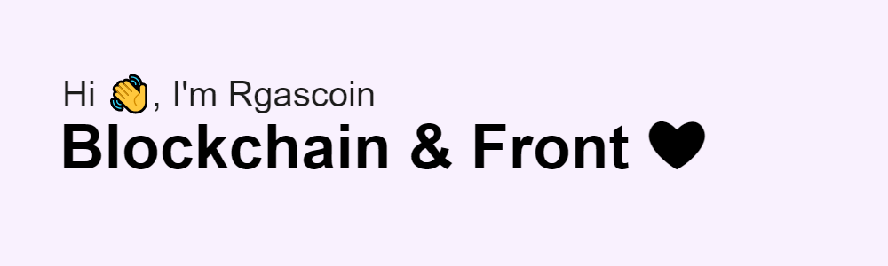

<!--
**Rgascoin/Rgascoin** is a ✨ _special_ ✨ repository because its `README.md` (this file) appears on your GitHub profile.
-->

# My Skills 🌟

# My current activity 😊

<!--START_SECTION:activity-->
1. 💪 Opened PR [#48](https://github.com/aleph-im/aleph-sdk-ts/pull/48) in [aleph-im/aleph-sdk-ts](https://github.com/aleph-im/aleph-sdk-ts)
2. 💪 Opened PR [#47](https://github.com/aleph-im/aleph-sdk-ts/pull/47) in [aleph-im/aleph-sdk-ts](https://github.com/aleph-im/aleph-sdk-ts)
3. 💪 Opened PR [#46](https://github.com/aleph-im/aleph-sdk-ts/pull/46) in [aleph-im/aleph-sdk-ts](https://github.com/aleph-im/aleph-sdk-ts)
4. 🗣 Commented on [#329](https://github.com/anmol098/waka-readme-stats/issues/329) in [anmol098/waka-readme-stats](https://github.com/anmol098/waka-readme-stats)
5. ❗️ Opened issue [#329](https://github.com/anmol098/waka-readme-stats/issues/329) in [anmol098/waka-readme-stats](https://github.com/anmol098/waka-readme-stats)
<!--END_SECTION:activity-->

